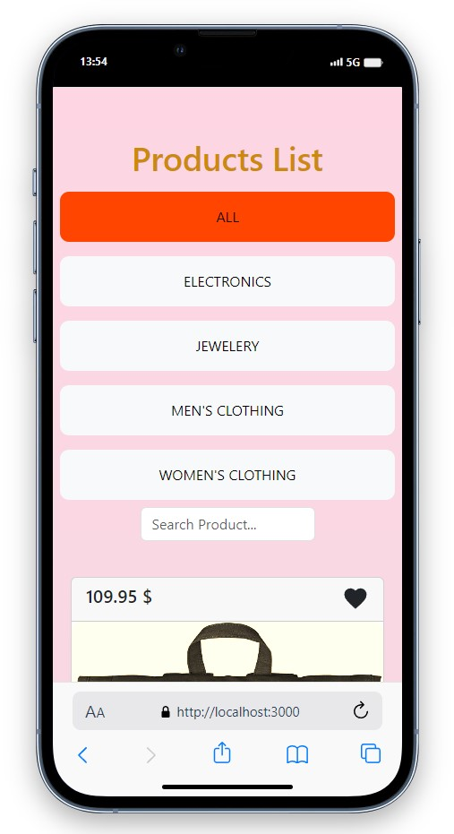
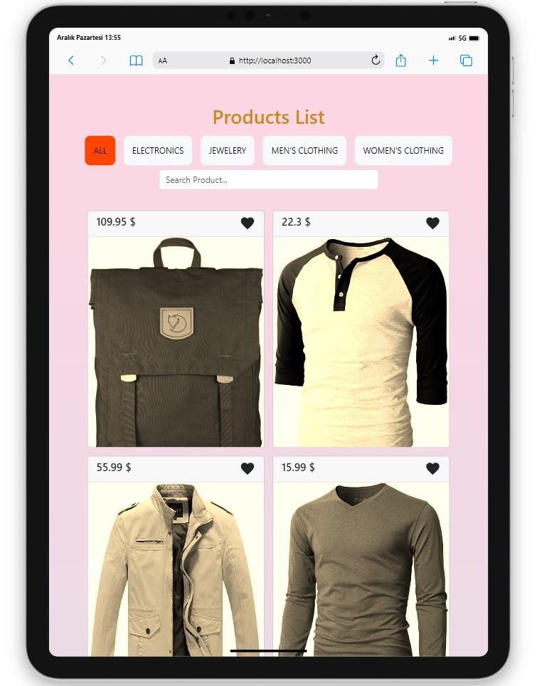

# Product List V2

<div align="center">
  
</div>

## About the Project

This project contains a simple web application for managing a list of products. Additionally, the application features a search functionality.


## Live Demo

[Product List V2 Demo](https://product-list-v2-eta.vercel.app/)

## Project Skeleton

```
Product List V2 (folder)
|
|----readme.md        
SOLUTION
├── public
│     └── index.html
├── src
┣ 📂assets
┣ 📂components
┃ ┣ 📂Header
┃ ┃ ┣ 📜Header.jsx
┃ ┃ ┗ 📜Header.scss
┃ ┗ 📂ProductCard
┃ ┃ ┣ 📜ProductCard.jsx
┃ ┃ ┗ 📜ProductCard.scss
┃ ┃ ┣ 📜ProductsList.jsx
┣ 📂helper
┃ ┗ 📜data.js
┣ 📂scss
┃ ┣ 📜_reset.scss
┃ ┗ 📜_variables.scss
┣ 📜App.js
┣ 📜App.scss
┗ 📜index.js
```
## Screenshots

<div align="center">
  
  
  
</div>

## Compatibility

The project is compatible with both wide-screen computers and mobile devices.
